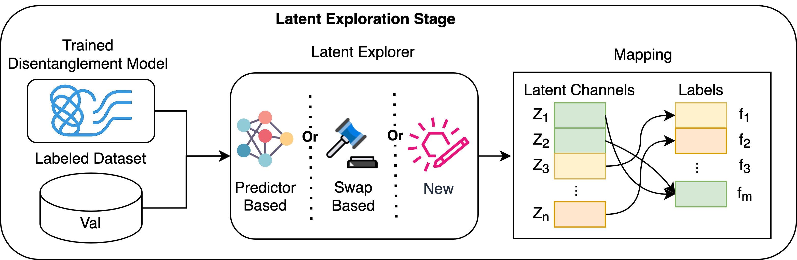

# MSD Benchmark: Latent Exploration Module

The MSD (Multi-factor Sequential Disentanglement) benchmark evaluates models based on their ability to learn disentangled latent representations. A key part of this evaluation is **latent exploration**: probing the learned latent space to assess which factors of variation are represented and how they are encoded.

This document describes:

- What latent exploration is
- Available implementations in MSD
- How to configure or extend the module



---

## Purpose of Latent Exploration

Latent exploration methods aim to interpret and analyze the latent space of trained models. These methods seek to:

- Identify latent dimensions that correspond to semantic factors
- Quantify alignment between ground-truth attributes and learned representations

This is particularly important in MSD, where both **static** and **dynamic** factors govern the data.

---

## Integration via `LatentExplorer`

The `LatentExplorer` is an abstract base class responsible for computing factor-to-latent mappings, based on a trained model and labeled dataset. It supports:

- **Supervised evaluation:** Assumes that the dataloader provides both inputs and corresponding ground-truth factor labels.
- **Caching of results** during training/testing
- **Per-batch exploration mode** for models that require real-time latent evaluation (e.g., SKD and SSM-SKD)
- **Torch-based integration** with models and evaluation pipeline

Each `LatentExplorer` must implement the method:

```python
def eval(self, epoch: int, data_loader: DataLoader) -> Tuple[Any, Dict[str, List[int]]]:
```

This method receives an epoch number and a data loader, and returns a mapping of ground-truth factors to relevant latent dimensions.

To retrieve a mapping from any component, use:

```python
latent_explorer.get_map(epoch=10)  # returns a mapping for epoch 10
```

---

## Available Implementations

### 1. `PredictorLatentExplorer`

This explorer trains one supervised classifier per ground-truth factor to predict it from the latent space.

- Classifiers can be scikit-learn models (e.g., random forest, gradient boosting)
- Feature importances from these classifiers determine factor-to-latent alignment
- Reported metrics: classification accuracy and strongest aligned dimensions

### 2. `SwapLatentExplorer`

This explorer measures factor preservation under latent interventions.

- Each sample is encoded to latent space
- A subset of latent channels is replaced with another sample's values
- The output is decoded and evaluated by a judge model
- Accuracy is tracked per latent subset and factor
- A final mapping is computed using a matching algorithm

---

## Configuration

Latent explorers are defined within the configuration file of each method under `latent_explorer_cfg`:

```yaml
latent_explorer_cfg:
  name: PredictorLatentExplorer
  parameters:
    batch_exploration: false
```

See [docs/configuration.md](configuration.md) for full examples of where and how this appears in method-specific configs.

---

## Creating a Custom Latent Explorer

To implement your own latent explorer:

1. Inherit from `LatentExplorer`
2. Implement the `eval()` method
3. Optionally use `self.dataset`, `self.model`, and `self.logger`

Example:

```python
class MyCustomExplorer(LatentExplorer):
    def eval(self, epoch: int, data_loader):
        # Compute latent representations and evaluate structure
        return score, mapping
```

You can register it through your configuration by referencing the appropriate class name and file.

### A final note:

Custom methods can leverage **domain-specific knowledge or assumptions** about the latent space. For example, if a model explicitly separates static and dynamic factors, a latent explorer may probe these groups independently.

---

## Summary

Latent exploration is a central tool in MSD for evaluating whether a model has discovered meaningful and interpretable representations. By offering both supervised (predictor-based) and unsupervised (swap-based) strategies, MSD supports diverse model types. Users can extend the framework by implementing their own latent explorers tailored to their models or data.
